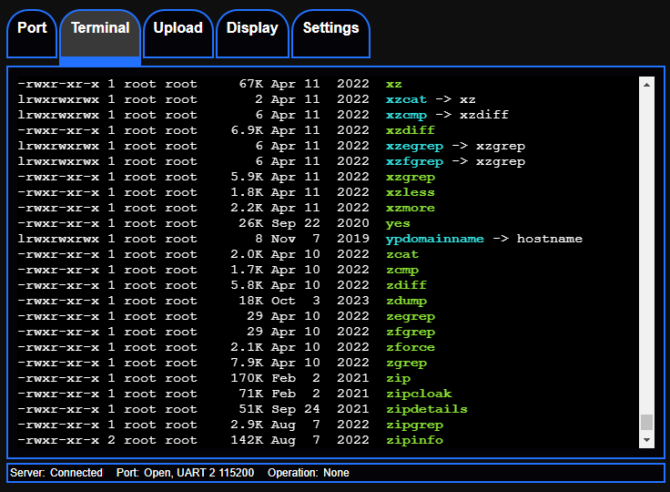
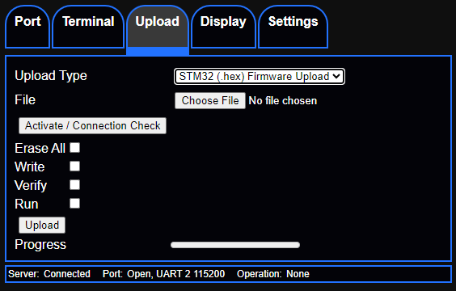
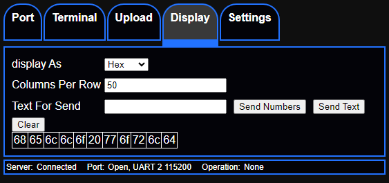

## Serial/UART Interfacing Tool ##
Web application that runs on an ESP32 accessed over WIFI - alternative to USB serial converters.

Works in mobile and desktop browsers.

#### features ####

* terminal
* send/view data in hex and or other formats
* upload firmware to an STM32 over a UART connection

## Why ##

I had an idea, I could replace use of USB UART adaptors with an ESP32 running a web interface with the common tools
I use such as crafting packets in hex to manually test protocols, uploading firmware to STM32 chips and sometimes a serial terminal. I had some projects where getting a laptop to the device after deployment for debugging / firmware updating was not that covenant.

## Tech used / Design  ##

Backend based on platform IO with ESP idf.
HTTP Server is one I created for a different project and ported to RTOS the latency was round x3 lower then the HTTP Server in the ESP SDK.
frontend based on preactjs the terminal render is xtermjs.

The idea was to keep the server side lightweight and do all the heavy lifting (protocol specific encode/decode) client side.
So the tool could by easily extended later by allowing internally stored externally hosted and plugins to be loaded dynamically. this only adds a relatively small amount of latency.

### Setup ###

Tested on a esp-wroom-32 dev board

### desired features / TODO ###

* TLS and authentication support
* ESP firmware upload support
* support for controlling DTR and RTS
* UI Plugin support
* Host for USB Serial devices -
  it appears some ESP32 chips can support being a Host for USB serial devices. there is drivers and examples, so
  it would be neat to have that as a feature.

 Have a different idea or want to help? pull requests are welcome.

## building ##
 * backend
   `platformio run --environment esp32`
### frontend ###
 * install dependencies with `npm install`
  
* to build `npm run build` 
  this will package the webUI files into a header file called `webui_files.h` this file is then included in the backend build
 * local testing `npm run dev`
